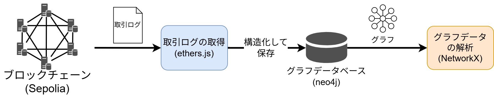

# trust-score

## Overview


## System Architecture

以下に流れを示す。

1. 過去のNFTの取引履歴を取得する
2. 取引履歴をネットワーク形式に構造化する
3. ネットワークから中心性と類似性を抽出する


以下の分析を行うシステムアーキテクチャ
まずブロックチェーン

1. ブロックチェーンの取引ログをethers.jsで取得する
2. Neo4jのグラフ形式に構造化して保存する
3. NetworkXを活用して中心性(次元中心性・媒介中心性・PageRank)を分析する



## Set Up

### Required Tools

- nvm
- node(バージョンは `/log-listener/.nvmrc` を参照してください)
- docker
- docker-compose

### Installation Steps

リポジトリのクローンをする。
```bash
git clone https://github.com/C0A21130/trust-score.git
```


```bash
cd log-listener
nvm use
npm install
```


```bash
cd log-listener
npm run dev
```

別のターミナルを開いて
```bash
cd ..
docker-compose up -d
```
http://localhost:3000
