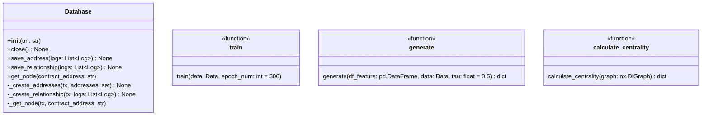

# Trust Engine

Trust Engineはユーザーの信用スコアを算出するためのTrust Scring Systemのコンポーネントである。

## Overview

[Trust Engine](/trust-engine/)はユーザーの信用スコアを算出するモジュールである。
Trust Engineは信用スコア算出におけるつながりの推定と信用スコアの算出を行う。
算出した信用スコアはTrust Scoring Agentに提供する。

**信用スコア算出の流れ**
1. 過去のNFTの取引履歴をブロックチェーンから取得する
2. NFT取引履歴をネットワーク形式に構造化する
3. GNN(Graph Neural Network)を用いてユーザー間のつながりを推定する
4. 推定後のネットワークから中心性に基づいた信用スコアを算出する


## Library

- **JupyterLab**
    - データサイエンスと機械学習のための統合開発環境
    - ノートブック、コードエディタ、ターミナルが統合
    - データ分析・可視化, 機械学習モデルの開発・実験
- **Neo4j**
    - グラフデータベースNeo4jのPython クライアントライブラリ
    - ノードとエッジのグラフデータを表現, Cypherクエリ言語をサポート
    - ソーシャルネットワーク分析, 知識グラフの構築
- **NetworkX**
    - 複雑なネットワークの作成・操作・分析を行うPythonライブラリ
    - ネットワーク分析機能やネットワーク可視化の実装
    - Trust Engineの中心性算出を担当
    - URL: [NetworkX](https://networkx.org/)
- **PyTorch**
    - 深層学習フレームワーク
    - ニューラルネットワークの構築・訓練
    - CUDA サポートによるGPU加速
    - URL: [PyTorch](https://pytorch.org/)
- **PyTorch Geometric**
    - グラフニューラルネットワーク(GNN)ライブラリ
    - PyTorch ベースのグラフ深層学習
    - Trust Engineのつながり推定を担当
    - URL: [PyG Documentation](https://pytorch-geometric.readthedocs.io/en/latest/)

PyTrochとPyTorch GeomtricはGPUアリの環境で動作させることが可能である。
詳しいGPU動作環境については、[GPU Environment Construction](./environment.md)に記載している。

## Components

Trust Engineは3つのコンポーネントが存在する
1. Centorality Calculator: 中心性を算出する
    - calculate_centrality: 次数中心性・媒介中心性・PageRankを算出する
2. Network Generetor: つながりを推定しネットワークを生成する
    - train: GNNのモデルを学習する
    - generetor: 学習済みモデルを利用してネットワークを生成
3. database: グラフデータベースとのインターフェース
    - Database: グラフデータベースから情報を取得してDataframeに変換する



**Trust Engineの処理の流れ**

1. 取引ネットワークをグラフデータベースから取得する
2. 取引ネットワークを用いてユーザー間のつながりを推定する
3. つながりを推定したネットワークから信用スコアを算出する

### Centrality Calculator

ネットワークの中心性を活用して信用スコアを算出する。
[centrality.py](/trust-engine/app/components/centralality.py)ではNetworkXの機能を用いて各中心性を算出する。算出する中心性3つは以下の通りである。

- **Degree Centrality**
    - 取引が多いユーザーのスコアを高くする
    - 次数中心性 $c_d(v_i)$ はユーザー $v_{i}$ の次数 $d_{i}$ から算出される
    - $\frac{1}{|V|-1}$ により正規化する
    ```math
    c_d(v_i) = \frac{1}{|V|-1}\sum_{u\in V}d_{i}
    ```
- **betweenness**
    - ２頂点間を結ぶ経路上にしばしば現れる頂点を中心とする(橋渡し役のようなノードを算出可能)
    - ノード $s$ と $t$ までの経路を $dis_{st}$ とする
    - $dis_{st}(v_i)$ はノード $v_i$ が経路に現れる場合である
    ```math
    C_{b}(v_{i}) = \sum_{s\in V}\sum_{t\in V \atop t\neq s}\frac{dis_{st}(v_i)}{dis_{st}}
    ```
- **PageRank**
    - ノード間を推移させた際に最終的に移動しているノードの重要度を高くしたスコア
    - 推移確率行列 $P$ は全てのノードが次のタイミングでどのノードに移動する確率を示す行列である
    - 大域ジャンプ行列行列 $E$ は隣接しない異なるノードへジャンプする確率を示す行列である
    - ジャンプ確率 $\alpha$ はランダムに隣接していないページへ移動する確率
    - 実際は最大固有値に対応する固有ベクトルを求めることで算出される
    ```math
    PR(v_i) = PR(v_i) \lbrace \lparen 1 - \alpha \rparen P + \alpha E\rbrace
    ```

### Network Generator

**GNN(Graph Neural Network)**

GNNを用いてユーザー間のつながりの推定をする。
GNNは、ノードとエッジで構成されるネットワーク構造データを扱うためのニューラルネットワークである。
各ノードが隣接ノードから情報を受け取り、自身の特徴を更新することで情報の埋め込みを行う。
画像やテキストのような固定構造ではなく、非構造・関係性重視のデータに対応している。

**VGAE(Variational Graph Auto-Encoder)**

Trust EngineはGNNの中でもVGAEを利用する。
VGAEは、GNNをベースにした教師なし学習モデルで、ネットワークの構造を潜在空間に圧縮し、再構成することでネットワーク生成を行う。
VGAEはグラフエンコーダーとグラフデコーダーに2つから構成される

- グラフエンコーダー $p_\phi(Z|X)$ は取引ネットワーク(隣接行列 $X$ , 頂点特徴量 $A$ )を潜在変数 $Z$ に埋め込む
    - 潜在変数$Z$は平均値 $\mu$ と標準偏差 $\sigma$ による正規分布に従っている
    - 潜在変数 $Z$ はGCNの埋め込みによって求められる
    ```math
    Z = \mathcal{N}(\mu, \sigma^2),
    \quad \mu = \text{GCN}_\mu(X, A),
    \quad \sigma = \text{GCN}_\sigma(X, A)
    ```
- グラフデコーダー $p_\theta(X|Z)$ はグラフエンコーダーによって埋め込まれた潜在変数 $Z$ を基にネットワークを生成する
    - $Z$ の積によりユーザー間の類似度を求める
    - 類似度を活性化関数 $\sigma$ を利用して接続する確率に変換する
    ```math
    X = \sigma(Z_i^\top Z_j)
    ```

- [train.py](/trust-engine/app/components/train.py)
    - ロギング設定: 学習の進捗やモデル情報を`data/train.log`に記録するためのロガーをセットアップ
    - [model.py](/trust-engine/app/components/model.py)に従いVGAEのモデルを初期化する
    - CUDAが利用可能ならGPU、利用不可ならCPUを選択し、データとモデルを転送
    - Adamオプティマイザを用いた最適化手法の設定
    - 指定したエポック数だけ学習を繰り返し, 再構成誤差とKLダイバージェンスを計算し、合計損失で逆伝播・パラメータ更新を行う
- [generate.py](/trust-engine/app/components/generate.py)
    - 学習済みVGAEモデルをロードする
    - ノードの潜在表現を取得し正・負例のスコアを計算する
    - ROC曲線からYouden's J統計量で最適な閾値を決定
    - ノード間の類似度行列を計算し、閾値を超えるものを新たなエッジとして抽出する
    - 生成したネットワークに対して中心性を計算する

## Example

ネットワーク分析やGNNの学習に適した資料を[trust-engine/basic](/trust-engine/basic/)に設置している。
詳細は[basic.md](/docs/basic.md)のドキュメントを参照。
