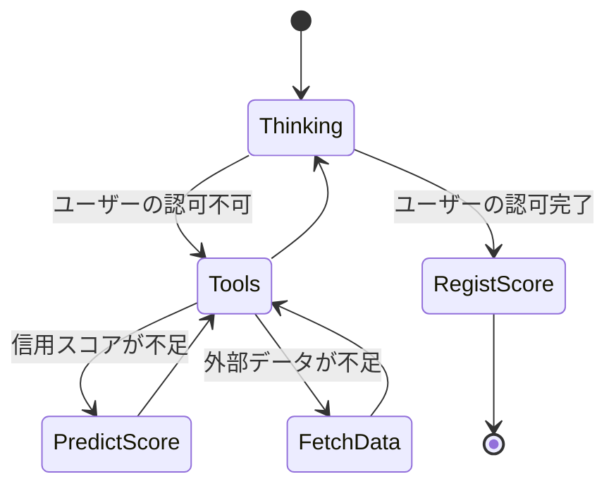
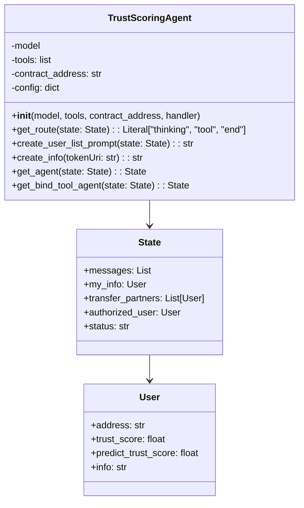

# Trust Scoring Agent

Trust Scoring Agentはユーザーの信用度に基づいてアクセス制御をするAIエージェントである

## Overview

[Trust Scoring Agent](/trust-scoring-agent/)は[Trust Engine](/trust-engine/)から取得した信用スコアや取得したデータを基にユーザーのアクセス制御するTrust Scoring Systemのモジュールである。
外部ストレージにはIPFS・データベース・APIなどが含まれる
従来のクライアントサーバーシステムでは、管理者がユーザーのアクセス制御を担い、認可サーバーを呼び出すことでアクセス制御している。
しかしブロックチェーンを中心としたWeb3サービスでは認可サーバや管理者が存在しない。
Trust Scoring Systemでは管理者によるユーザーのアクセス制御の判断をAIエージェントに代替させることで管理者を必要としないユーザーのアクセス制御を実現する。

## Components

Trust Scoring Agentにはコンポーネントとなる2つのサブAgentが存在する

- Auth thinking: 信用スコアやデータからユーザーの認可判断をする
- Tools calling: 信用スコアやデータを取得する
    - PredictScore: Trust Scoreが算出したユーザーの信用スコアを取得する
    - FetchData: SBTやIPFSからユーザーに関わるデータを取得する

各エージェントは状態によって推移する

[trust_scoring_agent.py](/trust-scoring-agent/app/components/trust_scoring_agent.py)のTrustScoringAgentクラスは信用スコアに基づいて認可するエージェントを実装したメインクラスである
- get_agent(): 信用スコアを計算し、取引相手を認可するAuth thinkingエージェントを提供
- get_bind_tool_agent(): ツールをバインドしたTools callingエージェントを提供し、動的にツールを呼び出す

### Auth thinking

事前に信用スコアを計算し信用スコアに基づいて取引相手を認可する。
現在のStateを基にユーザーの認可判断を行う。

### Tool calling

Trust Scoring Agentは外部ツールであるスマートコントラクトやTrust Engineの呼び出しや外部データの取得を行う。

**Trust engine calling**

[engine.py](/trust-scoring-agent/app/tools/engine.py)ではTurst Engineを通して算出された信用スコアを取得する

**Smart contract calling**

ブロックチェーンを呼び出し信用スコアの登録やSBTの取得をする。

1. リクエスト＋関数一覧の送信: リクエストには、実行可能なスマートコントラクト関数の一覧も含まれている
2. 呼び出す関数を予測して引数を返す: LangGraphベースのAgentが、LLMを活用してリクエスト内容を解析し、どの関数を呼び出すべきかを予測する
3. 関数の実行: 予測された関数と引数をもとに、Web3.pyを通じてスマートコントラクトを呼び出す
4. 実行結果の処理: スマートコントラクトから返された結果を受け取り、再びLLMがその内容を解釈・整形する
5. 処理結果の返却: 最終的に、整形された結果がユーザーまたは呼び出し元に返され、状態管理（State）にも記録される

**Data fetching**

外部データを取得する
- IPFS
    - URI先のコンテンツが存在すれば信頼できる
- データベース(未実装)
- SBT(未実装)
