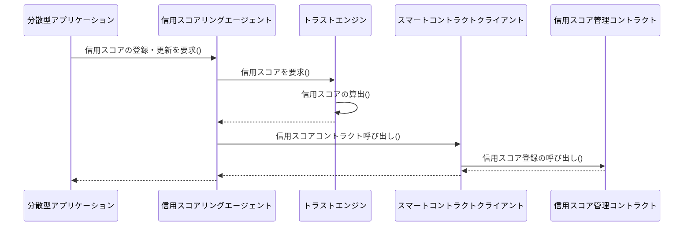
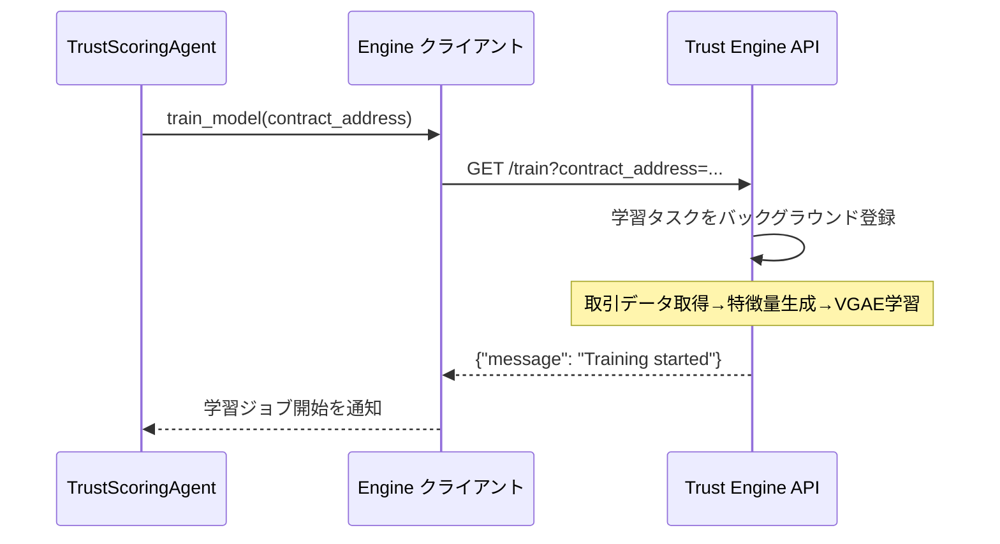
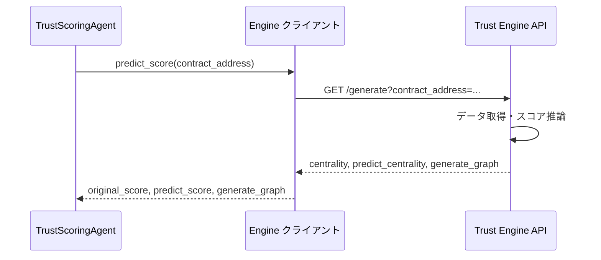

# Trust Scoring Agent

信用スコアリングエージェントはユーザーの信用度に基づいてアクセス制御をするAIエージェントである

## Overview

[信用スコアリングエージェント](/trust-scoring-agent/)は[トラストエンジン](/trust-engine/)から取得した信用スコアや取得したデータを基にユーザーのアクセス制御する信用スコアリングシステムのモジュールである。
従来のクライアントサーバーシステムでは、管理者がユーザーのアクセス制御を担い、認可サーバーを呼び出すことでアクセス制御している。
しかしブロックチェーンを中心としたWeb3サービスでは認可サーバや管理者が存在しない。
信用スコアリングシステムでは管理者によるユーザーのアクセス制御の判断をAIエージェントに代替させることで管理者を必要としないユーザーのアクセス制御を実現する。

## API エンドポイント

信用スコアリングエージェントはFastAPIベースのアプリケーションであり、[trust-scoring-agent/app/main.py](/trust-scoring-agent/app/main.py)に定義されたエンドポイントを通じて信用ログの永続化やアクセス制御判定、テストトークンの配布を行う。
より詳細な仕様はコンテナ起動後に[http://localhost:9000/docs](http://localhost:9000/docs)から自動生成ドキュメントを確認する。

| メソッド | パス | 説明 | 主なパラメータ | 主なレスポンス項目 |
| --- | --- | --- | --- | --- |
| GET | `/` | コントラクト初期化状態を検証し、API稼働を通知するヘルスチェック | なし | `message`（失敗時はHTTP 500） |
| POST | `/logs` | 取引ログバッチを受信し、アドレスと関係性をNeo4jへ保存 | `contract_address`(body), `transfer_logs[]`(body) | `message` または `error` |
| POST | `/auth` | トラストエンジンのスコアとオンチェーン閾値を組み合わせて認可対象を決定 | `contract_address`(body), `from_address`(body), `to_address_list[]`(body) | `message`, `authorized_users`, `other.authorized_graph_users`, `other.authorized_score_users` |
| GET | `/faucet` | テスト用ETHを指定アドレスへ配布 | `address`(query) | `message`（失敗時はHTTP 500） |

### アクセス制御の流れ

[trust_scoring_agent.py](/trust-scoring-agent/app/components/trust_scoring_agent.py) の `auth` メソッドが実装する認可フローは次のとおりである。

1. **信用スコアの取得**: Trust Engine にリクエストを送り、`original_score`・`predict_score`・`generate_graph` を取得する。
    - `original_score`: GNNを用いないシンプルな中心性一覧
    - `predict_score`: GNNにより予測された取引ネットワークの中心性一覧
    - `generate_graph`: GNNにより予測された取引ネットワーク
2. **ブロックチェーンへの登録**: `from` アドレスおよび `to` アドレスそれぞれについて基準値を選び、スマートコントラクトの `regist_score` 関数を通じて信用スコアを記録する。双方のスコアのうち高い方を基準値として扱う。

## ツールの呼び出し

信用スコアリングエージェントは外部ツールであるスマートコントラクトやトラストエンジンの呼び出しやスマートコントラクトの呼び出し、外部データの取得を行う。

**トラストエンジンの呼び出し**

[engine.py](/trust-scoring-agent/app/tools/engine.py)ではTurst Engineを通して算出された信用スコアを取得する

以下は`Trust Engine`に学習ジョブを依頼し、バックグラウンドでGNNのモデル更新を開始する流れである。
`Trust Engine`のモデルの学習は時間がかかるためバックグラウンドで学習が行われる。

以下は`Trust Engine`が学習されたモデルを用いて信用スコアの算出を行いエージェントがスコアを取得する流れである

**Smart contract calling**

ブロックチェーンを呼び出し信用スコアの登録やSBTの取得をする。

1. リクエスト＋関数一覧の送信: リクエストには、実行可能なスマートコントラクト関数の一覧も含まれている
2. 呼び出す関数を予測して引数を返す: LangGraphベースのAgentが、LLMを活用してリクエスト内容を解析し、どの関数を呼び出すべきかを予測する
3. 関数の実行: 予測された関数と引数をもとに、Web3.pyを通じてスマートコントラクトを呼び出す
4. 実行結果の処理: スマートコントラクトから返された結果を受け取り、再びLLMがその内容を解釈・整形する
5. 処理結果の返却: 最終的に、整形された結果がユーザーまたは呼び出し元に返され、状態管理（State）にも記録される

