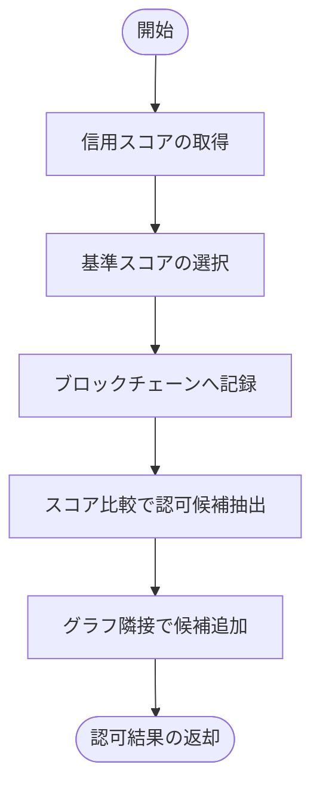
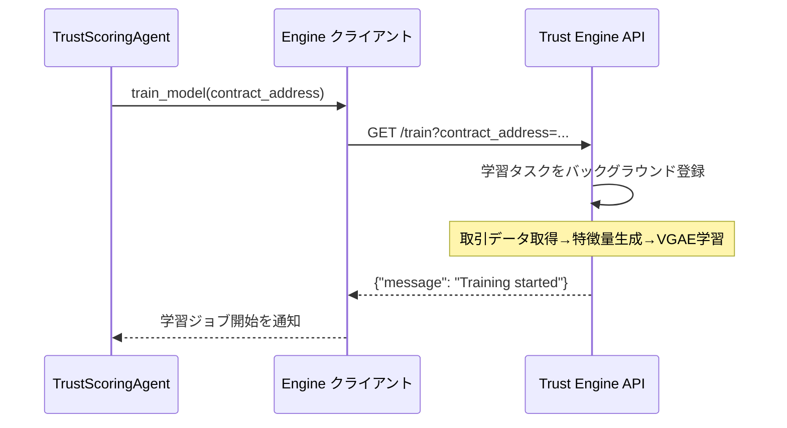
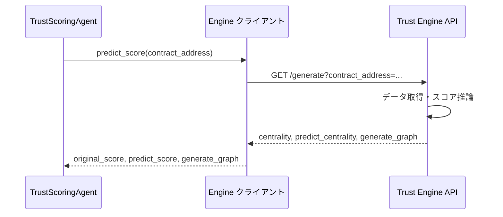

# Trust Scoring Agent

Trust Scoring Agentはユーザーの信用度に基づいてアクセス制御をするAIエージェントである

## Overview

[Trust Scoring Agent](/trust-scoring-agent/)は[Trust Engine](/trust-engine/)から取得した信用スコアや取得したデータを基にユーザーのアクセス制御するTrust Scoring Systemのモジュールである。
従来のクライアントサーバーシステムでは、管理者がユーザーのアクセス制御を担い、認可サーバーを呼び出すことでアクセス制御している。
しかしブロックチェーンを中心としたWeb3サービスでは認可サーバや管理者が存在しない。
Trust Scoring Systemでは管理者によるユーザーのアクセス制御の判断をAIエージェントに代替させることで管理者を必要としないユーザーのアクセス制御を実現する。

## API dcoument

以下にAPIとエンドポイントの一覧を記載しました。
より詳細な仕様はコンテナの起動後、[http://localhost:9000/docs](http://localhost:9000/docs)にアクセスすることでリクエストやレスポンスの確認やテストが可能である。

| メソッド | パス | 説明 |
| --- | --- | --- |
| GET | `/` | API の稼働状態を即座に確認するためのヘルスチェック。バックエンドが起動しているかをクライアントや監視ジョブが判定する際に利用する。 |
| POST | `/logs` | 取引ログのバッチ（送信元・送信先・トークン量など）を受け取り、グラフデータベースにアドレス情報と関係性を保存する。取引履歴の蓄積や後段のスコア計算に必要な前処理を担う。 |
| POST | `/auth` | 指定コントラクトの参加者について Trust Engine からスコアを取得し、ブロックチェーン上のしきい値や予測スコアを組み合わせて認可対象を判定する。判定結果にはグラフ推論・スコア比較双方の観点が含まれる。 |
| GET | `/faucet` | テストネット上で所定のスマートコントラクトを経由し、指定アドレスへテスト用の`ETH`を配布する。開発・検証用途でウォレットに残高を補充したい場合に利用する。 |

### Agent auth workflow

[trust_scoring_agent.py](/trust-scoring-agent/app/components/trust_scoring_agent.py) の `auth` メソッドが実装する認可フローは次のとおりです。

1. **信用スコアの取得**: Trust Engine にリクエストを送り、`original_score`・`predict_score`・`generate_graph` を取得する。
    - `original_score`: GNNを用いないシンプルな中心性一覧
    - `predict_score`: GNNにより予測された取引ネットワークの中心性一覧
    - `generate_graph`: GNNにより予測された取引ネットワーク
2. **ブロックチェーンへの登録**: `from` アドレスおよび `to` アドレスそれぞれについて基準値を選び、スマートコントラクトの `regist_score` 関数を通じて信用スコアを記録する。双方のスコアのうち高い方を基準値として扱う。
3. **スコアベースの判定**: `compare_score` 関数を利用して `from` と各 `to` のスコアを比較し、スマートコントラクト側のしきい値を満たしたアドレスを `authorized_score_users` として採用する。
4. **グラフベースの判定**: Trust Engine が返す `generate_graph` から `from` アドレスに隣接する取引相手を抽出し、`authorized_graph_users` として追加する。

## Tool calling

Trust Scoring Agentは外部ツールであるスマートコントラクトやTrust Engineの呼び出しや外部データの取得を行う。

**Trust engine calling**

[engine.py](/trust-scoring-agent/app/tools/engine.py)ではTurst Engineを通して算出された信用スコアを取得する

以下は`Trust Engine`に学習ジョブを依頼し、バックグラウンドでGNNのモデル更新を開始する流れである。
`Trust Engine`のモデルの学習は時間がかかるためバックグラウンドで学習が行われる。

以下は`Trust Engine`が学習されたモデルを用いて信用スコアの算出を行いエージェントがスコアを取得する流れである

**Smart contract calling**

ブロックチェーンを呼び出し信用スコアの登録やSBTの取得をする。

1. リクエスト＋関数一覧の送信: リクエストには、実行可能なスマートコントラクト関数の一覧も含まれている
2. 呼び出す関数を予測して引数を返す: LangGraphベースのAgentが、LLMを活用してリクエスト内容を解析し、どの関数を呼び出すべきかを予測する
3. 関数の実行: 予測された関数と引数をもとに、Web3.pyを通じてスマートコントラクトを呼び出す
4. 実行結果の処理: スマートコントラクトから返された結果を受け取り、再びLLMがその内容を解釈・整形する
5. 処理結果の返却: 最終的に、整形された結果がユーザーまたは呼び出し元に返され、状態管理（State）にも記録される

**Data fetching**

外部データを取得する
- IPFS
    - URI先のコンテンツが存在すれば信頼できる
- データベース(未実装)
- SBT(未実装)
